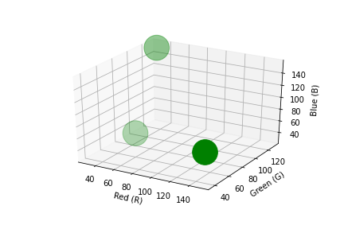
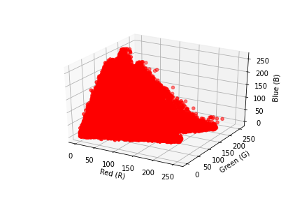
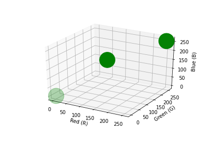
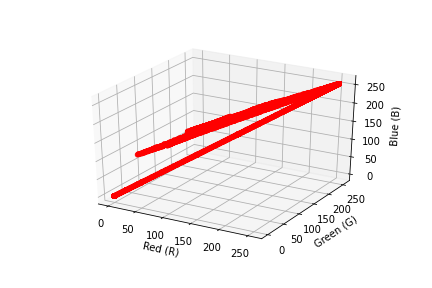
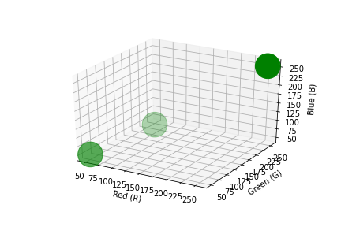
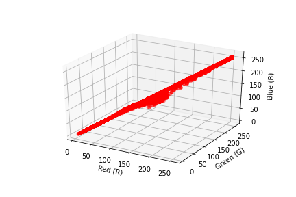

# prominent-colors-detector
A engine which detects prominent colors from the image.

## Install Python Package
```
pip install image-pcd
```

## Usage

```python
from pcd import ImageProminentColor
from sklearn.cluster import KMeans

image_color = ImageProminentColor("<path to image file>")
prominent_colors = image_color.get_prominent_colors(KMeans, 3)
```
The above code-snippet gives you top 3 prominent colors in RGB form sorted in decreasing order of prominence from the image.

```python
image_color.get_image_plot("<Save image file path>")
image_color.get_color_plot("<Save image file path>")
```
The above code-snippet allows you to save the images of plots of the prominent color and image original colors in 3D-space with RGB components as axis.

## Samples (For top-3 Prominent Colors)
| Sample Image | Prominent Colors | Prominent Colors Plot | Image Colors Plot |
| ------------ | ---------------- | -------------------- | ---------------- |
|  |  `#215d1d` <br/>  `#97244a` <br/>  `#1d8197` |  |  |
|  |  `#7579b0` <br/>  `#fdfdfe` <br/>  `#010101` |  |  |
|  |  `#fefefe` <br/>  `#323232` <br/>  `#67a15d`  |  |  |